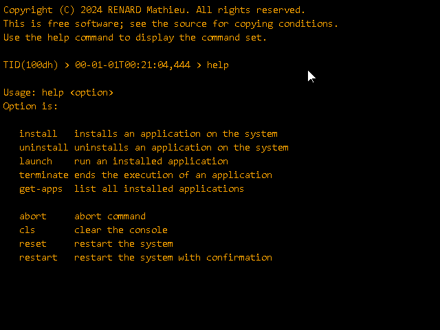

# Shell

**Shell** is a Command Line Interface (**CLI**) developed for the **Mk** 
operating system.
**Shell** is used to execute internal or external operating system commands.

Type **help** to display all available commands :

To run **Shell**, build the application and place the executable file (**.elf**) 
and its logo on **the file system** at the following address : 
[mk/apps/shell/](https://github.com/EmbSoft3/Mk/tree/main/Mk/Storage/mk/apps/shell)

## Build

**Shell** can be built using the [makefile](Shell/Make/makefile) file on the 
repository.

The variable **TOOLCHAIN_PATH** must be updated with the path of the ARM
toolchain.
The variable **INCLUDES_API_PATH** must be updated with the 
[include path](https://github.com/EmbSoft3/Mk/tree/main/Mk/Includes) of 
the **Mk** operating system.

First, issue a **make clean** command then build the target with **make all**.

Currently versions of compiler used are the followings:

- **gcc** arm-none-eabi-gcc (GNU Arm Embedded Toolchain 10.3-2021.10) 10.3.1 
  20210824 (release)
- **g++** arm-none-eabi-g++ (GNU Arm Embedded Toolchain 10.3-2021.10) 10.3.1 
  20210824 (release)
- **make** GNU Make 4.4.1 Built for Windows32

Please note, that by default, the application is compiled in release mode with 
optimizations enabled (**-Ofast**).

## License

**Copyright (C)** 2024 **RENARD Mathieu**. All rights reserved.

Mk is free software; It is distributed in the hope that it will be useful.
There is NO warranty; not even for MERCHANTABILITY or 
FITNESS FOR A PARTICULAR PURPOSE.

The content of this repository is bound by the [BSD-3-Clause](LICENSE) license.

