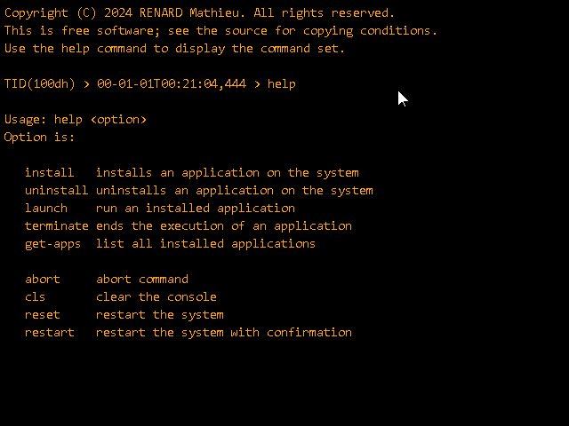

# Shell

**Shell** is a Command Line Interface (CLI) application for the [Mk](https://github.com/EmbSoft3/Mk)
operating system. It supports both built-in commands and externally loaded commands.

Shell is intended as a getting-started example showing how to build, install, and run an external .elf application on top of Mk.



---

## Commands

Type `help` in the shell to display all available commands.

| Command | Description |
|---------|-------------|
| `ls` | List directory contents |
| `cd` | Change current directory |
| `pwd` | Print working directory |
| `lsdsk` | List mounted disks and partitions |
| `launch` | Load and run an external `.elf` application |
| `install` / `uninstall` | Install or remove an application |
| `terminate` | Stop a running application |
| `getapps` | List installed applications |

For the complete list of commands and their usage, refer to the [Shell and Commands](https://github.com/EmbSoft3/Mk/wiki/Shell-and-Commands) wiki page.

---

## Installation

Build the application (see [Build](#build) below), then copy `shell.elf` and its
icon `mk_shell.bmp` to the Mk file system at:

```
mk/apps/shell/
```

This path corresponds to [`Mk/Storage/mk/apps/shell/`](https://github.com/EmbSoft3/Mk/tree/main/Mk/Storage/mk/apps/shell)
in the Mk repository. Once installed, Shell appears in the Mk home screen application list.

---

## Build

### Requirements

- [GNU Arm Embedded Toolchain 10.3-2021.10](https://developer.arm.com/downloads/-/gnu-rm) — must be added to your `PATH`
- CMake ≥ 3.25
- Ninja
- [Mk Includes](https://github.com/EmbSoft3/Mk/tree/main/Mk/Includes) — must be present at `../Mk/Mk/Includes` relative to the project root

### Build system

The project uses **CMake** with presets defined in `CMakePresets.json`:

| Preset | Type | Description |
|--------|------|-------------|
| `release-shell` | Release | Optimised build (`-Ofast`), stripped |
| `debug-shell` | Debug | Unoptimised build (`-O0 -g3`) with full debug symbols |

### Steps

1. Make sure `arm-none-eabi-gcc` is in your `PATH`:
   ```bash
   arm-none-eabi-gcc --version
   ```

2. Make sure the [Mk Includes](https://github.com/EmbSoft3/Mk/tree/main/Mk/Includes) directory
   is present at `../Mk/Mk/Includes` relative to the project root, or update `INCLUDES_API_PATH`
   in `CMakePresets.txt` accordingly.

3. Configure the project using the desired preset:
   ```bash
   cmake --preset release-shell
   ```

4. Build the firmware:
   ```bash
   cmake --build --preset release-shell
   ```

   This produces in `build/release-shell/`:
   - `shell.elf` — position-independent shared object, ready to install on the target
   - `shell.map` — linker map file

> Use the `debug-shell` preset for an unoptimised build with full debug symbols:
> ```bash
> cmake --preset debug-shell
> cmake --build --preset debug-shell
> ```

The application is compiled as a position-independent shared object (`-fPIC -shared`) and is
relocatable into any 64 KB memory page by the Mk dynamic loader.

### Compiler versions used

| Tool | Version |
|------|---------|
| `arm-none-eabi-gcc` | 10.3.1 20210824 (GNU Arm Embedded Toolchain 10.3-2021.10) |
| `arm-none-eabi-g++` | 10.3.1 20210824 (GNU Arm Embedded Toolchain 10.3-2021.10) |
| CMake | ≥ 3.25 |
| Ninja | latest |

---

## Debugging

Debugging a dynamically loaded application requires a specific GDB setup because Shell is a
position-independent shared object (`-fPIC -shared`) relocated at runtime by the Mk dynamic
loader. GDB must be told both **which symbol file to load** and **at which address it was placed
in memory**.

### Requirements

- A debug build of both **Mk** and **Shell** (see [Build](#build))
- A [J-Link](https://www.segger.com/products/debug-probes/j-link/) probe
- VSCode with the [Cortex-Debug](https://marketplace.visualstudio.com/items?itemName=marus25.cortex-debug) extension

### How the load address is determined

Shell is linked as a PIC shared object with a base address of `0x0`. At runtime, the Mk
dynamic loader allocates one or more 64 KB memory pages and copies the application image into
them. The effective load address therefore depends on which memory page the loader selected.

To find the load address of a running Shell instance, inspect the Mk allocator state in the
debugger to retrieve the base address returned to the application. This address is the value to
pass to GDB as the symbol offset.

As a reference, the example configuration uses `0xc044C000`. Adjust this value to match the
actual allocation reported by your Mk build.

### VSCode launch configuration

The following [`.vscode/launch.json`](.vscode/launch.json) configuration loads Mk symbols from
the kernel ELF (as the primary executable) and then overlays Shell symbols at the runtime
load address using `add-symbol-file`.

---

## Writing your own application

Shell is the reference example for the Mk application model. For a step-by-step guide
on how to structure your own Mk application — descriptor, entry point, event listeners,
memory layout — see the [Mk wiki](https://github.com/EmbSoft3/Mk/wiki/Writing%E2%80%90Your%E2%80%90First%E2%80%90Application).

---

## License

Copyright © 2024-2026 **Mathieu Renard**. All rights reserved.

This project is licensed under the **BSD 3-Clause License** — see the
[LICENSE](LICENSE) file for details.
